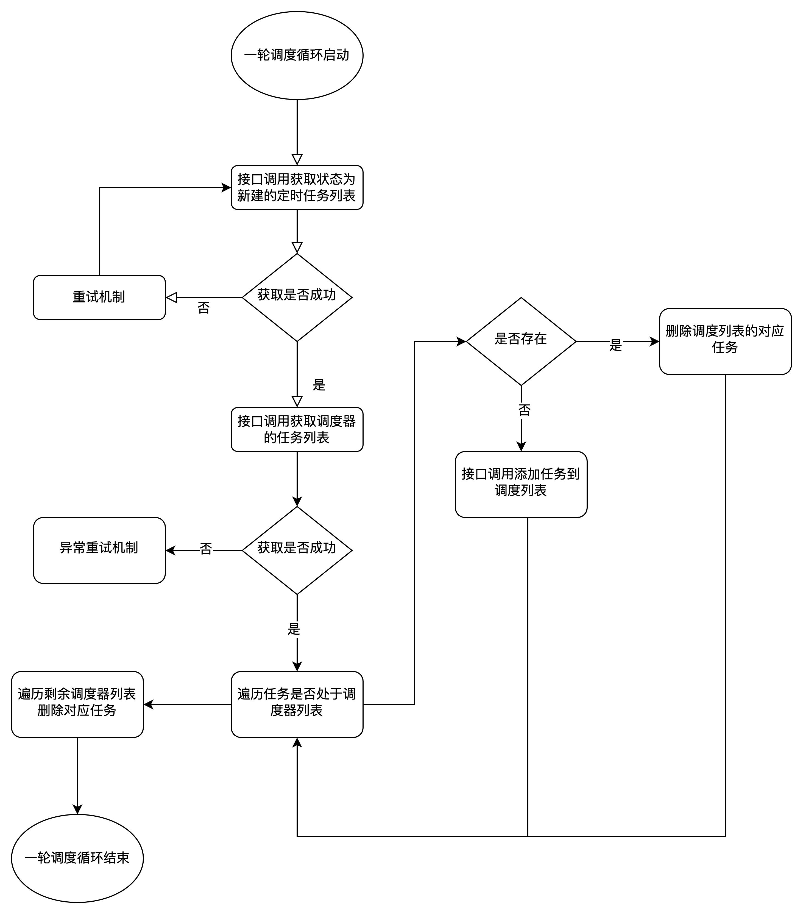

# 容器化的测试技术尝试

## 容器化测试环境

### 解析 docker-compose.yml

    1. 获取上传docker-compose.yml 文件
    2. 使用yaml解析库解析docker-compose.yml 文件

### 解析 Dockerfile

## 集成测试管道

## 并行化测试

## 模拟测试环境

## 自动化测试工具

## 容器监控化日志收集

# 定时任务调度器

